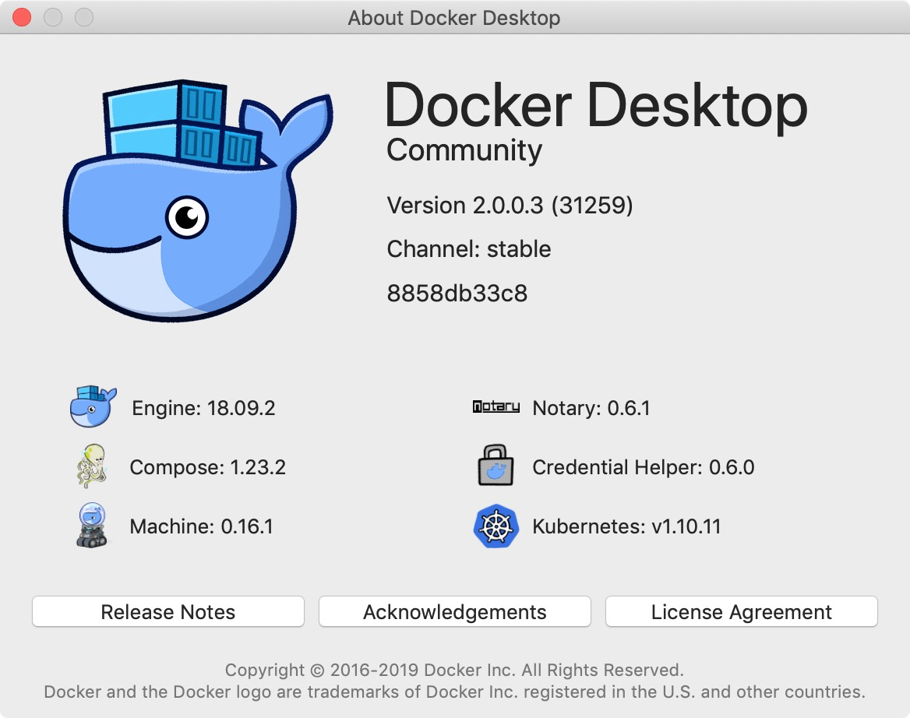
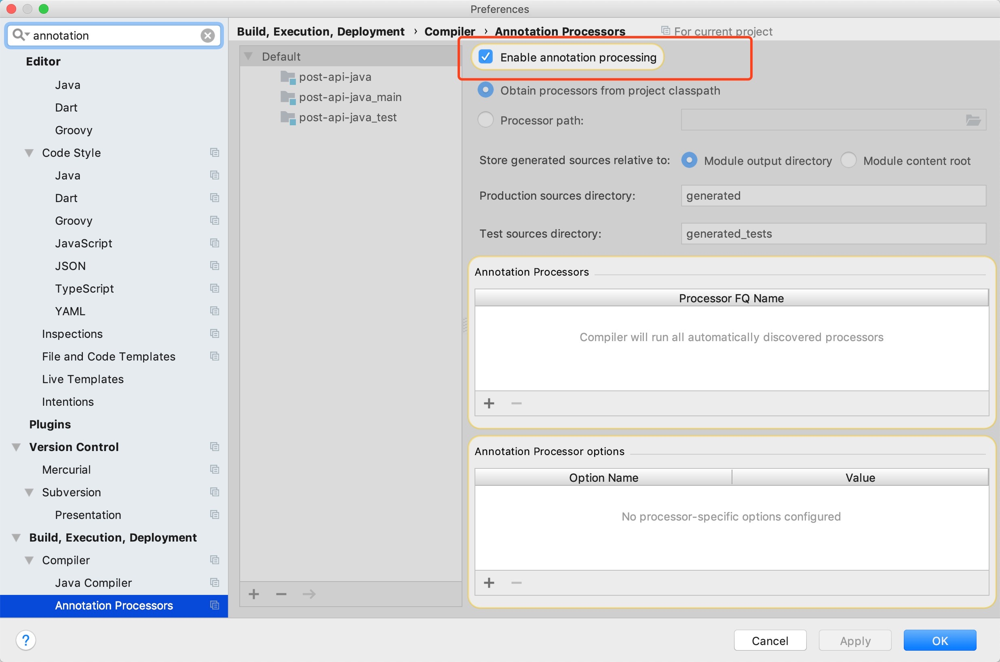

# 目录说明
```
├── README.md readme
├── asset readme资源文件
├── docker-compose.yaml docker-compose配置文件
├── graphql-api nodjs graphql网关
├── graphql-gateway-java java graphql网关
├── post-api-java post后端服务
├── protos protos文件
├── schema graphql文件
└── vue-apollo-sample 前端vue程序
```
# 运行环境
基础环境 | 版本
--- | ---
node | 10.16.0
python(node-gyp依赖python,用于编译node项目) | 3.7
jdk(开发，生产使用jre) | 1.8.0_211
gradle | 4.8.1

# docker/docker-compose启动
## 版本(docker/docker-compose)

## 下载
```
git clone https://github.com/silencecorner/graphql-grpc-exmaple.git
```
## 编译
```
docker-compose build
```
## 运行
```
docker-compose up -d
```
只postgres用学习调试
```
docker-compose up -d postgres
```
# 访问地址
### docker-compose启动
#### java网关
- playground访问地址 http://localhost:8800/playground
- voyager访问地址 http://localhost:8800/voyager
- api接口访问地址 http://localhost:8800/graphql
- vue web访问地址 http://localhost:8010/

#### nodejs网关
- playground访问地址 http://localhost:4000/graphql
- api接口访问地址 http://localhost:4000/graphql
- vue web访问地址 http://localhost:8000/
    
### 本地启动
#### java网关
- playground访问地址 http://localhost:8888/playground
- voyager访问地址 http://localhost:8888/voyager
- api接口访问地址 http://localhost:8888/graphql
- vue web访问地址 http://localhost:8081/
#### nodejs网关 
- playground访问地址 http://localhost:4001/graphql
- api接口访问地址 http://localhost:4001/graphql
- vue web访问地址 http://localhost:8081/
  
## 停止删除镜像
### 停止
```
docker-compose down
```
### 停止删除镜像
```
docker-compose down --rmi all
```

## 说明
### docker版本
docker最低版本为[17.05.0-ce](https://docs.docker.com/engine/release-notes/#17050-ce)才支持stage构建
### lombok idea配置

### pb依赖文件生成
当clone下来是发现未找到grpc接口、类的定义，不要慌，build一下就可以啦！
#### linux/mac下
```
./gradlew build -x test
```
#### windows下
```
gradlew.bat build -x test
```
### 依赖问题
因为一些原因项目依赖未下载完成，导致一堆红色报错，这是需要去重新拉去依赖可以执行以下命令
#### linux/mac下
```
./gradlew build --refresh-dependencies -x test
```
#### windows下
```
gradlew.bat build --refresh-dependencies -x test
```

# npm配置
https://segmentfault.com/a/1190000016090267?utm_source=tag-newest

# 原demo
https://medium.com/@svengau_17540/when-graphql-meets-grpc-3e9729d32e05

# proto-loader
https://github.com/grpc/grpc-node/tree/master/packages/proto-loader
<br>
https://github.com/protobufjs/protobuf.js

# apoll-sever
https://www.apollographql.com/docs/apollo-server/

## grphql-api
修改为yarn运行，yarn可以静态安装依赖，避免网络请求依赖下载不下来
### 安装依赖
```
yarn run install:offline
```
### 运行dev
```
yarn run dev
```
## [vue-apollo-sample](./vue-apollo-sample)
# graphql操作
```
mutation {
  addAuthor(
    request: { name: "海哥" }
  ) {
    id
    name
  }
}
```
```
mutation {
  addPost(
    request: { title: "第一个例子", body: "这是个我们网关的第一个例子" }
  ) {
    id
    title
    body
    createdAt
    author{
      id
      name
    }
  }
}

```
```
query{
  getAuthor(request:{id: 1}){
    id
    name
    posts(request:{page: 1,limit: 10}){
      page
      count
      limit
      nodes{
        id
        title
        body
        createdAt
      }
    }
  }
}
```
```
mutation{
	updatePost(request: {id: 1,body: "44441111"}){
    id
    title
     body
    createdAt
  }
}
```
```
query {
  posts: listPosts(request: { page: 1, limit: 20 }) {
    page
    limit
    count
    nodes: nodes {
      id
      title
      body
      createdAt
      author {
        id
        name
      }
    }
  }
}

```
# proto文件管理
## 注意事项
- proto文件名规范
> 本身编译时是支持文件名相同，只要的package不同就行，但是会觉得很怪，使用gradle插件编译的时候会出bug

### 问题修复
- [windows环境下无法在项目根目录下执行copy task](https://discuss.gradle.org/t/error-with-a-copy-task-on-windows/1803/4)
- `process.env.PWD`在windows下不生效，使用`process.cwd()`获取当前项目目录

### 新特性
[使用protoc-gen-validate做参数校验](https://github.com/envoyproxy/protoc-gen-validate)